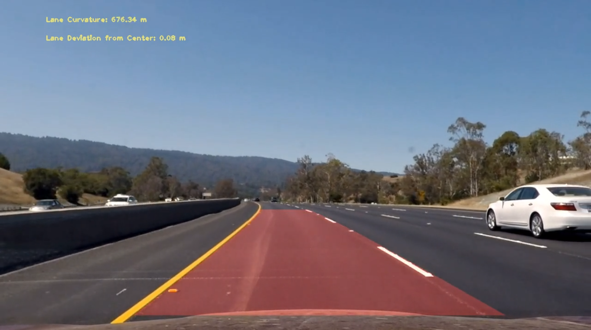

# Self-Driving Car Engineer Nanodegree
# Perspective Transforms and Classifiers
## Project: Advanced Lane Finding

### Overview

This project is a software pipeline to identify the lane boundaries in a video. There is a detailed writeup of the solution in `WRITEUP_Submit.md`

The Project
---

The goals / steps of this project are the following:

* Compute the camera calibration matrix and distortion coefficients given a set of chessboard images.
* Apply a distortion correction to raw images.
* Use color transforms, gradients, etc., to create a thresholded binary image.
* Apply a perspective transform to rectify binary image ("birds-eye view").
* Detect lane pixels and fit to find the lane boundary.
* Determine the curvature of the lane and vehicle position with respect to center.
* Warp the detected lane boundaries back onto the original image.
* Output visual display of the lane boundaries and numerical estimation of lane curvature and vehicle position.

The images for camera calibration are stored in the folder called `camera_cal`.  The images in `test_images` are for testing the pipeline on single frames.

Files
---
`./pipeline/cameracal.py` - generate calibration matrix from chessboard images
`./pipeline/iamgegen.py` - main driver file
`./pipeline/linefitter.py` - LineFitter class for operations of extracting polyfit and buffering
